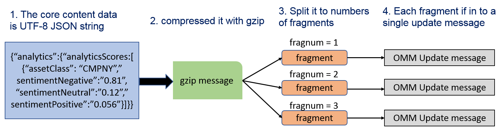

# How to get Machine Readable News Analytics via  WebSocket API with Python
- Last update: May 2021
- Environment: Windows
- Compiler: Python and Conda distribution
- Prerequisite: Refinitiv Real-Time Advanced Data Hub and Refinitiv Real-Time Advanced Distribution servers version 3.2.1 and above, MRN service

## Project Overview

This project shows how developers may use the [Websocket API for Pricing Streaming and Real-Time Service](https://developers.refinitiv.com/en/api-catalog/refinitiv-real-time-opnsrc/refinitiv-websocket-api) aka Websocket API application to consume [Refinitiv News Analytics (TRNA)](https://my.refinitiv.com/content/mytr/en/product/machine-readable-news-analytics.html) data from Refinitiv Real-Time Distribution System (Refinitiv Real-Time Advanced Data Hub and Refinitiv Real-Time Advanced Distribution Server) via Machine Readable News (MRN) domain. The example just connects to Refinitiv Real-Time via a WebSocket connection, then subscribes and shows how to get each TRNA field data in a classic Jupyter Notebook application. The project is implemented with Python language, but the main concept for consuming and assembling MRN and TRNA messages are the same for all technologies. 

You can find the full article regarding this project at [How to get MRN News Analytics Data via WebSocket API](https://developers.refinitiv.com/en/article-catalog/article/how-to-get-mrn-news-analytics-data-via-elektron-websocket-api) page.

## Prerequisite

This example is focusing on the Refinitiv Machine Readable News (MRN) data processing only. I highly recommend you check the  [WebSocket API Tutorials](https://developers.refinitiv.com/en/api-catalog/refinitiv-real-time-opnsrc/refinitiv-websocket-api/tutorials) page if you are not familiar with WebSocket API. 

The Tutorials page provides a step-by-step guide (connect, log in, request data, parse data, etc) for developers who are interested in developing a WebSocket application to consume real-time data from Refinitiv Real-Time. 

## Refinitiv News Analytics Overview

[Refinitiv News Analytics (TRNA)](https://my.refinitiv.com/content/mytr/en/product/machine-readable-news-analytics.html) provides real-time numerical insight into the events on multiple news sources, in a format that can be directly consumed by algorithmic trading systems. TRNA enables algorithms to exploit the power of news to seize opportunities, capitalize on market inefficiencies, and manage event risk.

TRNA is published via Refinitiv Real-Time as part of Refinitiv Machine Readable News (MRN) data model. MRN is an advanced service for automating the consumption and systematic analysis of news. It delivers deep historical news archives, ultra-low latency structured news, and news analytics directly to your applications. 

### MRN Data Model

MRN is published over Refinitiv Real-Time using an Open Message Model (OMM) envelope in News Text Analytics domain messages. The Real-time News content set is made available over MRN_STORY RIC. The content data is contained in a FRAGMENT field that has been compressed and potentially fragmented across multiple messages, to reduce bandwidth and message size.

A FRAGMENT field has a different data type based on a connection type:
* RSSL connection (RTSDK [C++](https://developers.refinitiv.com/en/api-catalog/refinitiv-real-time-opnsrc/rt-sdk-cc)/[Java](https://developers.refinitiv.com/en/api-catalog/refinitiv-real-time-opnsrc/rt-sdk-java)): BUFFER type
* WebSocket connection: Base64 ASCII string

The data goes through the following series of transformations:

1. The core content data is a UTF-8 JSON string
2. This JSON string is compressed using gzip
3. The compressed JSON is split into several fragments (BUFFER or Base64 ASCII string) which each fit into a single update message
4. The data fragments are added to an update message as the FRAGMENT field value in a FieldList envelope

 

Therefore, to parse the core content data, the application will need to reverse this process. The WebSocket application also needs to convert a received Base64 string in a FRAGMENT field to bytes data before further process this field. This application uses Python [base64](https://docs.python.org/3/library/base64.html) and [zlib](https://docs.python.org/3/library/zlib.html) modules to decode Base64 string and decompress JSON string. 

If you are not familiar with MRN concept, please visit the following resources which will give you a full explanation of the MRN data model and implementation logic:
* [Webinar Recording: Introduction to Machine Readable News](https://developers.refinitiv.com/news#news-accordion-nid-12045)
* [Introduction to Machine Readable News (MRN) with Enterprise Message API (EMA)](https://developers.refinitiv.com/en/article-catalog/article/introduction-machine-readable-news-mrn-elektron-message-api-ema).
* [News Analytics Data Models and User Guide section in My Refinitiv's TRNA page](https://my.refinitiv.com/content/mytr/en/product/thomson-reuters-news-analytics.html).
* [MRN Data Models and Refinitiv Real-Time SDK Implementation Guide](https://developers.refinitiv.com/en/api-catalog/refinitiv-real-time-opnsrc/rt-sdk-java/documentation#mrn-data-models-implementation-guide).
* [Introduction to Machine Readable News with WebSocket API](https://developers.refinitiv.com/en/article-catalog/article/introduction-machine-readable-news-elektron-websocket-api-refinitiv).
* [How to get MRN News Analytics Data via WebSocket API](https://developers.refinitiv.com/en/article-catalog/article/how-to-get-mrn-news-analytics-data-via-elektron-websocket-api).

## Prerequisite
This example requires the following dependencies software  and libraries.
1. Refinitiv Real-Time Advanced Data Hub and Refinitiv Real-Time Advanced Distribution Server version 3.2.x with WebSocket connection and MRN Service.
2. [Python](https://www.python.org/) compiler and runtime.
3. Python [Anaconda](https://www.anaconda.com/distribution/) or [MiniConda](https://docs.conda.io/en/latest/miniconda.html) distribution/package manager.
4. [Classic Jupyter Notebook](https://jupyter.org/) web application.

*Note:* 
- This Project has been qualified with Python version 3.7.6 and Conda version 4.8.1
-  You can install a classic Jupyter Notebook on your local machine and then test the example on the machine. The alternate choice is a free Jupyter Notebook on cloud environments such as [Azure Notebook](https://notebooks.azure.com/) provided by Microsoft. You can find more details from [this tutorial](https://docs.microsoft.com/en-us/azure/notebooks/tutorial-create-run-jupyter-notebook). If you are not familiar with Jupyter Notebook, the following [tutorial](https://www.datacamp.com/community/tutorials/tutorial-jupyter-notebook) created by DataCamp may help.
- It is not advisable to change the Refinitiv Real-Time Distribution System configuration if you are not familiar with the configuration procedures. Please consult your Market Data administrator for any questions regarding Refinitiv Real-Time Distribution System-MRN service configuration.

## Application Files
This example project contains the following files and folders
1. *notebook_python/mrn_trna_notebook_app.ipynb*: The example Jupyter Notebook application file
2. *console/mrn_trna_console_app.py*: The  example console application file
3. *MRN_TRNA_env.yml*: The Jupyter Notebook environment and dependencies configuration file
4. *requirements.txt*: The console example dependencies configuration file
5. *LICENSE.md*: Project's license file
6. *README.md*: Project's README file

## How to run this example

Please be informed that your Refinitiv Real-Time Advanced Data Hub and Refinitiv Real-Time Advanced Distribution Server should have a Service that contains MRN data. The first step is to unzip or download the example project folder into a directory of your choice, then choose how to run the application based on your environment below.

### Classic Jupyter Notebook example
1. Open Anaconda Prompt and go to the project's folder
2. Run the following command in an Anaconda Prompt to create a Conda environment named *MRN_TRNA* for the project.
  ```
  (base) $>conda env create -f MRN_TRNA_env.yml
  ```
3. Once the environment is created, activate MRN_TRNA environment with this command in Anaconda Prompt
  ```
  (base) $>conda activate MRN_TRNA
  ```
4. In the current Anaconda Prompt, go to the project's notebook folder. Run the following command to start the classic Jupyter Notebook in the notebook folder.
  ```
  (MRN_TRNA) $>jupyter notebook
  ```
5. Open *mrn_trna_notebook_app.ipynb* Notebook document, then follow through each notebook cell.

### A console example
1. Go to project folder in th
2. Run ```$> pip install -r requestments.txt``` command in a console to install all the dependencies libraries.
3. Then you can run mrn_console_app.py application with the following command
    ```
    $> python mrn_trna_console_app.py --hostname <Real-Time Advanced Distribution Server IP Address/Hostname> --port <WebSocket Port> 
    ```
4. The application subscribes ```MRN_TRNA``` RIC code from Real-Time Advanced Distribution Server by default. 

*Note:* 
- Please refer to the [pip installation guide page](https://pip.pypa.io/en/stable/installing/) if your environment does not have the [pip tool](https://pypi.org/project/pip/) installed. 
- If your environment already has a websocket-client library installed, you can use ```pip list``` command to verify a library version, then use ```pip install --upgrade websocket-client``` command to upgrade websocket-client library. 


## Example Results
### Send MRN_STORY request to Real-Time Advanced Distribution Server
```
SENT:
{
  "Domain":"NewsTextAnalytics",
  "ID":2,
  "Key":{
    "Name":"MRN_TRNA"
  }
}
RECEIVED: 
[
  {
    "Domain":"NewsTextAnalytics",
    "Fields":{
      "ACTIV_DATE":"1970-01-01",
      "CONTEXT_ID":3929,
      "DDS_DSO_ID":12424,
      "FRAGMENT":null,
      "FRAG_NUM":0,
      "GUID":null,
      "MRN_SRC":"4.1.3_na_ent0-c383quja1adtc",
      "MRN_TYPE":null,
      "MRN_V_MAJ":null,
      "MRN_V_MIN":null,
      "PROD_PERM":10002,
      "RDN_EXCHD2":"MRN",
      "RECORDTYPE":30,
      "SPS_SP_RIC":".[SPSMANL1",
      "TIMACT_MS":0,
      "TOT_SIZE":0
    },
    "ID":2,
    "Key":{
      "Name":"MRN_TRNA",
      "Service":"API_RDF"
    },
    "PermData":"Ax+yEAAs",
    "Qos":{
      "Rate":"TickByTick",
      "Timeliness":"Realtime"
    },
    "SeqNumber":35024,
    "State":{
      "Data":"Ok",
      "Stream":"Open",
      "Text":"All is well"
    },
    "Type":"Refresh"
  }
]
```

### Receive Update message and assemble News 
```
RECEIVED: 
[
  {
    "DoNotCache":true,
    "DoNotConflate":true,
    "Domain":"NewsTextAnalytics",
    "Fields":{
      "ACTIV_DATE":"2020-02-12",
      "FRAGMENT":"H4sIAAAAAAAA/81V3XPaOBD/Vxi/lmRkAYX4zV9QUmwc2w3p3dx0hK0QBduisoHSDv97V5IppJPmZu7p/LD6eb+kXe2ufhikIsWhYVltWD/OP0nGBQXW38Cra9q4BSyGZbhBFH42ui2T50rHiKw+vhkhNBxiBMLYms+D5HoeGP+0mtMcbF/oKHZISgqCeUmqzpwVnYCINW1Yteq4vJPY8wkoLgVfU2FnDeMV6H4KPX88DX0PRI9M1E1AKylKYKFVBu7MrlGwak3zaa4DYHnEa6bt0VkIzhphjRchtl00mH3BCGETm2VV7T1W3zvpfhIHvuMt5jh+ekia5cNyVHs9hm6f18YRIqv4jhbNweXbqml3amipftUp9qzK+R62MfEH49j9oxj33xT3vLekgzelQ0+ddCNYRlMiVnATVc4y0nDxWy4FLeiO6AReI/l1jVqmtgTS3r55wQrpijRsB+roGvUxHmL8QrptBCmk0MSj/qB3IdOXoS1H+AYPBxfCBRd5G0e/3zV2vNiW9H+fYVUNdF9PQUe20ZLnh4R9hxAxhtAzXm5IdThb02/ZE6lW9NWqfqIkhxqF+1qBxImn/hi4pWoNl5cyS0QcDOuRFDXVqZOF33qHZO7PORzgI2gcajjXPRW13ixNrD5C75FpYogM2uP1TsDO8p0z4ruHcvjcG9ki9t6/C2+/Reh2PD087u8+fjezxY3xMvKcNCQ9bGRXh8CWTUppPiYlKw5yXKitLoI8RXj1ygxwOBF5JxJ8w2tad8afOx7bsZxWeQc8FJDALVlJD7SSCaINkburMVboiVP9iklOnG3OZKLUxAojywceLJNxqEGUuBrEYaSBdwKRO5ejTIaSQpnWDSk3sqwQRlcIX5k4RX1rgKweuh4i9NdpNLmCkobmf9BEWpPVtsieVD+0N9qQNU3o1207zo6yf7kMXPZsmFhxGidgWPOtyKiK8z9fnfbxbzG1J623y2eaqUY0Aks9A4ElBb4lK3RimYreKTp0YHGskaImMpECWFPzRq0DZWsqOlFW2s8HRT8qmrx4T7q/PzWBZd7Jpgmx5cxiDU5vFEBveq+BH8QTjQLfTlINlUNYY+i9MzJbi3A8PiG/9Tyfzlovju2mJ5NEg3Qyaw2ShZ1MbY0v0UNkuxrP/FAW1BYmcpVBL/eOx5+IdgrvigcAAA==",
      "FRAG_NUM":1,
      "GUID":"tr:FWN2AC05L_2002122Bb+B8ovXm7j38ArRD6+NJxP0JFIyfwQKz1cW9",
      "MRN_SRC":"C383QUJA1ADTC-4.0.6_TRNA-C383QUJA1ADTC",
      "MRN_TYPE":"TRNA",
      "MRN_V_MAJ":"2",
      "MRN_V_MIN":"10",
      "TIMACT_MS":17430856,
      "TOT_SIZE":886
    },
    "ID":2,
    "Key":{
      "Name":"MRN_TRNA",
      "Service":"API_RDF"
    },
    "PermData":"Ax+yEAAqEAEKEAILEAIqEAQLEAQrEARbEAZKEBAaEBGbEBIaECMLECYrECY7ECiLEDEM",
    "SeqNumber":35056,
    "Type":"Update",
    "UpdateType":"Unspecified"
  }
]
FRAGMENT length = 886
decompress News FRAGMENT(s) for GUID  tr:FWN2AC05L_2002122Bb+B8ovXm7j38ArRD6+NJxP0JFIyfwQKz1cW9
News = {'analytics': {'analyticsScores': [{'assetClass': 'CMPNY', 'assetCodes': ['P:4298007720', 'R:OOMS.OM'], 'assetId': '4298007720', 'assetName': 'Oman Oil Marketing Co SAOG', 'brokerAction': 'UNDEFINED', 'firstMentionSentence': 1, 'linkedIds': [{'idPosition': 0, 'linkedId': 'tr:FWN2AC05L_2002121mnnwDisVBTwGRMEBDWO2RhXStbXb8sD3i0Jjk'}], 
'noveltyCounts': [{'itemCount': 1, 'window': '12H'}, {'itemCount': 1, 'window': '24H'}, {'itemCount': 1, 'window': '3D'}, {'itemCount': 1, 'window': '5D'}, {'itemCount': 1, 'window': '7D'}], 'priceTargetIndicator': 'UNDEFINED', 'relevance': 1.0, 'sentimentClass': 1, 'sentimentNegative': 0.0422722, 'sentimentNeutral': 0.128453, 'sentimentPositive': 0.829275, 'sentimentWordCount': 44, 
'volumeCounts': [{'itemCount': 1, 'window': '12H'}, {'itemCount': 1, 'window': '24H'}, {'itemCount': 1, 'window': '3D'}, 
{'itemCount': 1, 'window': '5D'}, {'itemCount': 1, 'window': '7D'}]}], 'newsItem': {'bodySize': 223, 'companyCount': 1, 'exchangeAction': 'UNDEFINED', 'headlineTag': 'BRIEF', 'marketCommentary': False, 'sentenceCount': 5, 'wordCount': 52}, 
'systemVersion': 'TS:40060112'}, 'id': 'tr:FWN2AC05L_2002122Bb+B8ovXm7j38ArRD6+NJxP0JFIyfwQKz1cW9', 'newsItem': 
{'dataType': 'News', 'feedFamilyCode': 'tr', 'headline': 'BRIEF-Oman Oil Marketing Board Proposes FY Dividend ', 'language': 'en', 'metadata': {'altId': 'nFWN2AC05L', 'audiences': ['NP:E', 'NP:GFN', 'NP:PSC', 'NP:RNP', 'NP:DNP', 'NP:PCO'], 
'feedTimestamp': '2020-02-12T04:50:30.700Z', 'firstCreated': '2020-02-12T04:50:30.000Z', 'isArchive': False, 'takeSequence': 1}, 'provider': 'NS:RTRS', 'sourceId': 'FWN2AC05L_2002122Bb+B8ovXm7j38ArRD6+NJxP0JFIyfwQKz1cW9', 
'sourceTimestamp': '2020-02-12T04:50:30.000Z', 'subjects': ['M:NY', 'M:Z', 'E:F', 'G:1', 'G:Q',
 'G:7B', 'B:8', 'B:1010', 'B:2', 'B:219', 'B:5', 'E:1', 'E:G', 'G:F', 'G:H', 'G:K', 'G:S', 
 'R:OOMS.OM', 'P:4298007720', 'M:1QD', 'N2:BLR', 'N2:CMPNY', 'N2:DIV', 'N2:EMRG', 'N2:MEAST', 
 'N2:OM', 'N2:REFI', 'N2:REFI1', 'N2:ENFF', 'N2:ENER', 'N2:OILG', 'N2:BACT', 'N2:RES', 'N2:TGLF', 
 'N2:SWASIA', 'N2:ASIA', 'N2:ASXPAC', 'N2:LEN'], 'urgency': 3}}
```

## References
For further details, please check out the following resources:

* [Refinitiv Real-Time & Distribution Family page](https://developers.refinitiv.com/en/use-cases-catalog/refinitiv-real-time) on the [Refinitiv Developer Community](https://developers.refinitiv.com/) web site.
* [WebSocket API page](https://developers.refinitiv.com/en/api-catalog/refinitiv-real-time-opnsrc/refinitiv-websocket-api).
* [Developer Webinar Recording: Introduction to WebSocket API](https://www.youtube.com/watch?v=CDKWMsIQfaw).
* [Refinitiv News Analytics Product page](https://my.refinitiv.com/content/mytr/en/product/machine-readable-news-analytics.html).
* [Introduction to Machine Readable News with WebSocket API](https://developers.refinitiv.com/en/article-catalog/article/introduction-machine-readable-news-elektron-websocket-api-refinitiv).
* [How to get MRN News Analytics Data via WebSocket API](https://developers.refinitiv.com/en/article-catalog/article/how-to-get-mrn-news-analytics-data-via-elektron-websocket-api).
* [Introduction to Machine Readable News (MRN) with Enterprise Message API (EMA)](https://developers.refinitiv.com/en/article-catalog/article/introduction-machine-readable-news-mrn-elektron-message-api-ema).
* [MRN Data Models and Real-Time SDK Implementation Guide](https://developers.refinitiv.com/en/api-catalog/refinitiv-real-time-opnsrc/rt-sdk-java/documentation#mrn-data-models-implementation-guide).
* [MRN WebSocket JavaScript example on GitHub](https://github.com/Refinitiv-API-Samples/Example.WebSocketAPI.Javascript.NewsMonitor).
* [MRN WebSocket C# NewsViewer example on GitHub](https://github.com/Refinitiv-API-Samples/Example.WebSocketAPI.CSharp.MRNWebSocketViewer).

For any question related to this example or WebSocket API, please use the Developer Community [Q&A Forum](https://community.developers.refinitiv.com/spaces/152/websocket-api.html).